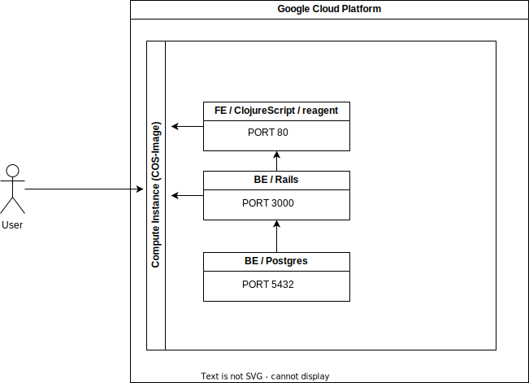

# Clojure-RubyOnRails-Postgres-Overview

Current state / infra
--



Public endpoints
--
   1. [Rails/Postgres] http://35.222.209.189:3000/api/v1/products
   2. [Rails/Postgres] http://35.222.209.189:3000/api/v2/dog
   3. [Rails/Postgres] http://35.222.209.189:3000/api/v2/person
   4. [Clojure/Reagent] http://35.222.209.189/

Repos
--
1. FE _> https://github.com/SeduroDotCom/rubyOnRails
2. BE _> https://github.com/SeduroDotCom/RailsWithPostgres

### FE / ClojureScript with reagent
1. Repo _> https://github.com/SeduroDotCom/rubyOnRails
2. Setup workflow
3. Example
   ```bash
   ```

### BE / Rails with postgres
1. Repo _> https://github.com/SeduroDotCom/RailsWithPostgres
2. Setup workflow
3. Setups
   1. Development (Mac/M1)
      1. Rails with Docker-Postgres
      2. Docker-Rails with Docker-Postgres
      3. Docker-Compose (Rails & Postgres)
   2. Public (GoogleCloud-Platform & ComputeInstance)
      1. FE _> https://github.com/SeduroDotCom/rubyOnRails
      2. BE _> https://github.com/SeduroDotCom/RailsWithPostgres
4. Endpoints / Szenarios
   1. Project (all, ..)
   2. Person & Dogs Mapping
      1. Person
      2. Dog
      3. POST both by `create_people_and_dogs`-endpoint
         ```bash
         curl --location 'http://localhost:3000/api/create_people_and_dogs' \
            --header 'Content-Type: application/json' \
            --data '{
              "people": [
                {
                  "name": "John",
                  "surname": "Doe",
                  "dog_race": "Labrador"
                },
                {
                  "name": "Jane",
                  "surname": "Smith",
                  "dog_race": "Poodle"
                }
              ]
            }'
         ```
5. POI's
   1. Seed.rb
   2. Used libraries
      1. bootstrap
      2. reagent


TODO
--
1. Setup for GCP-VM-Instance & K8s
  1. Terraform infra
  2. CI/CD
     1. onCommit
     2. E2E-Test / Visual-Test
     3. Release deployment by commitHash
3. Backup / Restore
4. Cleanup namings
5. Required tools
   1. https://rspec.info/
   2. https://cucumber.io/
6. Tools
   1. https://app.diagrams.net/#
   
